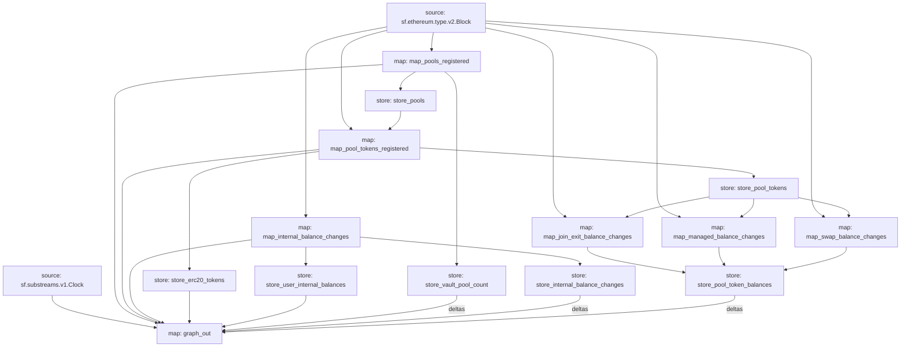

# Balancer Substreams

Extracts all pools registered to Balancer Vault with its tokens balances and users internal balances.

## Generating Protobuf

```bash
make protogen
```

## Compile

```bash
make build
```

## Run Substream

```bash
# run the graph_out module
make stream

```

## Pack to release

```bash
make package

```

## Deploy Substream

```bash
# have to change slug in Makefile
make deploy

```

## Visual Data Flow


